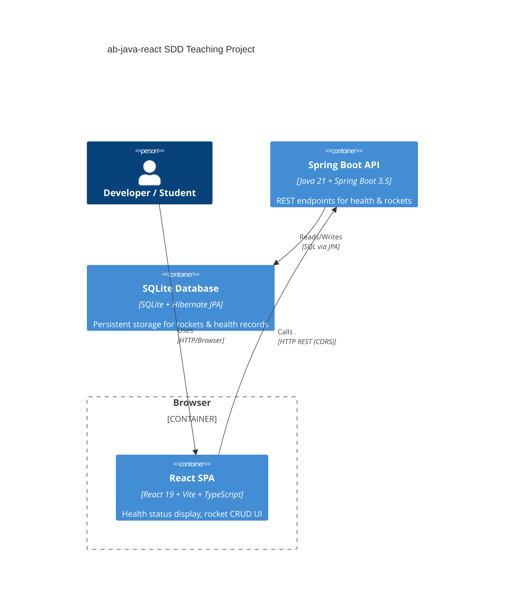
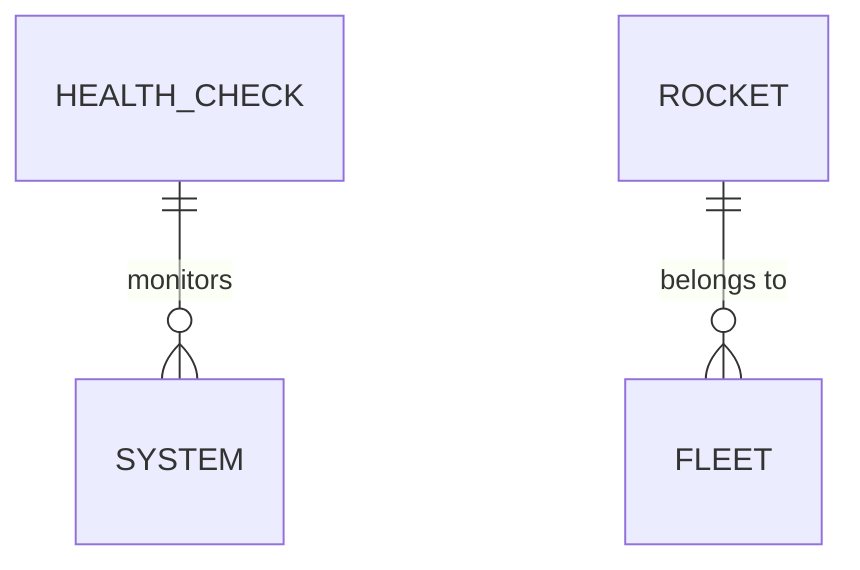

# Architecture — ab-java-react

## Overview

A full-stack SDD teaching project demonstrating domain-driven design and test-driven development. Users interact with a React SPA that calls a Spring Boot REST API to manage system health checks and a fleet of rockets. Data persists in SQLite via Hibernate ORM. The system is containerized for local development and tested end-to-end via Playwright.

---

## Containers & components



### Code organization

**Pattern**: Feature-based (one domain per folder) with layered responsibilities.

```text
back/src/main/java/dev/aiddbot/abjavareact/
├── AbJavaReactApplication.java      # Spring Boot entry point
├── health/                           # Health domain feature
│   ├── HealthController.java         # HTTP endpoints
│   ├── HealthService.java            # Business logic
│   ├── HealthCheckRepository.java    # Data access
│   ├── HealthCheck.java              # JPA entity
│   └── HealthResponse.java           # DTO for API response
├── rockets/                          # Rockets domain feature
│   ├── RocketController.java         # HTTP endpoints
│   ├── RocketService.java            # Business logic
│   ├── RocketRepository.java         # Data access
│   ├── Rocket.java                   # JPA entity
│   ├── RocketRange.java              # Enum (SHORT, MEDIUM, LONG)
│   ├── RocketRequest.java            # DTO for API input
│   ├── RocketResponse.java           # DTO for API response
│   ├── RocketNotFoundException.java   # Domain exception
│   └── RocketExceptionHandler.java   # HTTP error mapping

front/src/
├── App.tsx                           # Root component
├── features/
│   ├── health/                       # Health feature
│   │   ├── HealthStatus.tsx          # Display component
│   │   ├── healthApi.ts              # API client
│   │   └── HealthStatus.test.tsx     # Unit tests
│   └── rockets/                      # Rockets feature
│       ├── RocketsFleet.tsx          # List/CRUD component
│       ├── rocketsApi.ts             # API client
│       └── RocketsFleet.test.tsx     # Unit tests
└── shared/                           # Cross-feature utilities
    ├── api/                          # HTTP client setup
    └── types/                        # Shared TypeScript types
```

### Key contracts

| Contract | Shape | Used by |
|----------|-------|---------|
| `GET /api/health` | ` {"status": "UP", "database": "OK", "uptime": {...}, "timestamp": "ISO8601"}` | HealthStatus.tsx |
| `GET /api/rockets` | `[{id, name, capacity, range, decommissioned}]` | RocketsFleet.tsx |
| `POST /api/rockets` | req: `{name, capacity, range}` → res: `{id, name, capacity, range, decommissioned}` | RocketsFleet.tsx |
| `GET /api/rockets/{id}` | `{id, name, capacity, range, decommissioned}` | RocketsFleet.tsx |
| `PUT /api/rockets/{id}` | req: `{name, capacity, range}` → res: `{id, name, capacity, range, decommissioned}` | RocketsFleet.tsx |
| `DELETE /api/rockets/{id}` | status 204 No Content | RocketsFleet.tsx |

---

## Domain entities



### HealthCheck

| Field | Type | Constraints |
|-------|------|-------------|
| `id` | UUID (String) | PK, auto-generated |
| `status` | Enum (UP, DOWN) | required, default UP |
| `database` | Enum (OK, DEGRADED, UNAVAILABLE) | required |
| `timestamp` | Instant | required, auto-set |

**Rules**: Status is UP only if database is OK. Each health check is immutable; queries always return the latest check. No update after creation.

### Rocket

| Field | Type | Constraints |
|-------|------|-------------|
| `id` | UUID (String) | PK, auto-generated |
| `name` | String | required, indexed, max 255 chars |
| `capacity` | Integer | required, ≥ 1 |
| `range` | Enum (SHORT, MEDIUM, LONG) | required, determines operational profile |
| `decommissioned` | Boolean | default false, soft-delete flag |

**Rules**: Once created, id and range are immutable. Decommissioned rockets are included in list but filtered by frontend. Updates via PUT only affect name and capacity; range is read-only. Delete is a soft-delete (set decommissioned=true). No orphan rockets (always bound to fleet context).

---

> last updated: June 3, 2026
